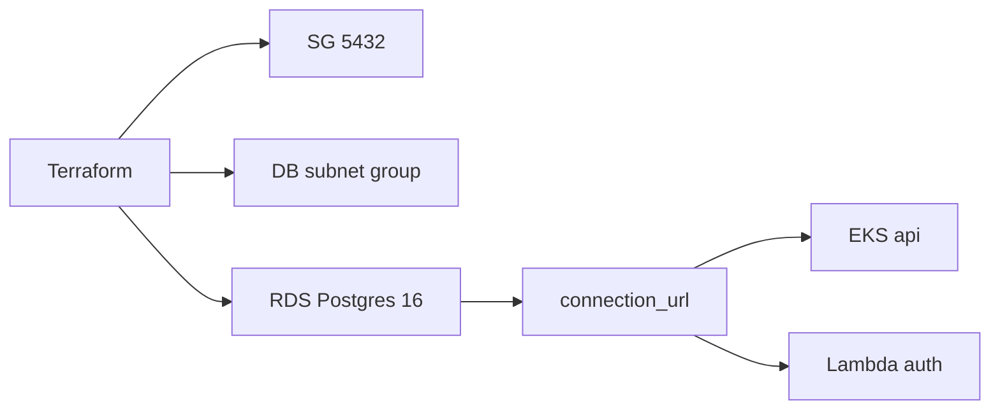

# infra-database — banco gerenciado

## Propósito

Provisiona o **RDS PostgreSQL** na VPC do lab. É o repositório Terraform do banco gerenciado exigido pelo Tech Challenge. A API NestJS, a Lambda de autenticação e o Job de migrations conectam na mesma instância via `DATABASE_URL`.

O AWS Academy Learner Lab **não cria DocumentDB** (`rds:CreateDBInstance` negado para engine `docdb`). PostgreSQL RDS (`db.t3.micro`, gp2 20 GB, sem Multi-AZ) está liberado e provisionado.

Não há Dockerfile: só Terraform.

## Tecnologias

- Terraform >= 1.5
- Provider `hashicorp/aws`
- RDS PostgreSQL 16, `db.t3.micro`, database `techchallenge`, subnets privadas da VPC `tech-challenge`
- State remoto em S3 (mesma conta do lab)

## Pré-requisitos

- Terraform 1.15.x e AWS CLI
- Credenciais do Learner Lab (`pbpaste | ~/scripts/pos-fiap-new/sync-lab-credentials.sh`)
- GitHub Secrets: `AWS_ACCESS_KEY_ID`, `AWS_SECRET_ACCESS_KEY`, `AWS_SESSION_TOKEN`

Depois do apply, copie `connection_url` para o secret `DATABASE_URL` nos repos `infra-kubernetes` e `lambda-auth`.

## Execução

```bash
pbpaste | ~/scripts/pos-fiap-new/sync-lab-credentials.sh
terraform -chdir=terraform/environments/prod init -input=false -backend-config=backend.hcl
terraform -chdir=terraform/environments/prod plan
terraform -chdir=terraform/environments/prod apply
terraform -chdir=terraform/environments/prod output -raw connection_url
```

## Deploy

Push na `main` aplica o Terraform. Ordem de merge: **este repo primeiro** → `infra-kubernetes` → `app` → `lambda-auth`.

## Pipeline

| Workflow | Gatilho | O que faz |
|---|---|---|
| [`terraform-plan.yml`](.github/workflows/terraform-plan.yml) | PR para `main` | `fmt`, `validate`, `plan` |
| [`deploy-prod.yml`](.github/workflows/deploy-prod.yml) | push na `main` | `apply` e imprime o endpoint |

A `main` é protegida.

## Diagrama deste repositório



Modelo de dados: [modelo-de-dados](https://github.com/tech-challenge-pos-fiap-debora/app/blob/main/docs/modelo-de-dados.md).

## APIs

Este repositório não expõe HTTP. Swagger da oficina: http://localhost:3000/api
